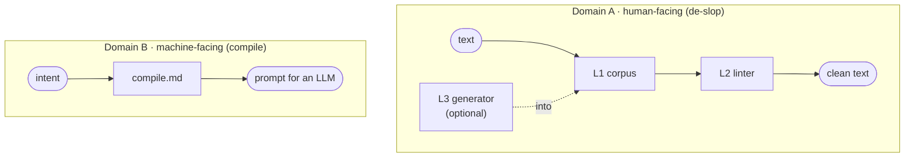

# mimesis

> μίμησις: imitation, representation.

Two opposite jobs for Claude Code. Strip AI tells from writing and design so they read as human-made, and compile dense, token-efficient instructions for a machine reader. The plugin is named after what the first job neutralises: the machine imitating a person.

The thesis is one line: **the guidelines outrank the model.** A versioned tell corpus and a deterministic linter carry the quality, not whichever model happens to be writing. When a future model regresses, the corpus and the linter still produce clean, em-dash-free text.

```
/plugin marketplace add blakecyze/mimesis
/plugin install mimesis
```

## The skills

| Skill | Domain | What it does | Invocation |
|---|---|---|---|
| `mimesis-human` | A | Remove the machine fingerprint from prose and add human texture. Audit, rewrite, or generate. | `/mimesis-human [text or file] [--register professional\|casual]` |
| `mimesis-concise` | A | Cut prose to what does work: throat-clearing, dutiful summaries, hedging, puffery, redundancy. | `/mimesis-concise [text or file]` |
| `mimesis-tone` | A | Write or recast prose in a named voice: persuasive, practitioner, warm, blunt, plain. Still de-slopped. | `/mimesis-tone [text] --tone <name> [--register professional\|casual]` |
| `mimesis-design` | A | Read-only audit of markup, CSS or a described UI for AI design tells: purple gradients, Inter 700, three-card rows. | `/mimesis-design [path]` |
| `mimesis-compile` | B | Compile dense, token-efficient instructions for an LLM. Bypasses the humanisation linter by design. | `/mimesis-compile [intent]` |
| `mimesis-principles` | A | Standing anti-tell rules so prose comes out clean by default. Loaded automatically. | auto |

## How it works

Domain A runs a three-layer stack; Domain B runs none of it. The linter is the line between them: it cleans every human-facing output and never touches a machine-facing one. Sharing machinery across that line is a bug, not a feature.



| Layer | What | Role |
|---|---|---|
| **L1** corpus | `tells`, `craft`, `design-tells`, `tones` | primary, model-independent, never skipped |
| **L2** linter | em dashes, kill-list, parallelism, hedges | runs on every Domain A output |
| **L3** generator | Claude by default, Codex via `--gen codex` | optional, swappable, never auto-routed |

The kill list in L1 is versioned by model era, because the tells drift. Domain B has its own reference, [`compile.md`](reference/compile.md), version-keyed to the 2026 model families with stale advice flagged.

## What the linter flags

A single Python 3 stdlib script, no dependencies. Detection only: it reports, the skill restructures.

| Category | Catches | Severity |
|---|---|---|
| `em-dash` | em dashes, plus the en-dash, double-hyphen and spaced-hyphen workarounds | blocker |
| `blacklist` | kill-list words, versioned by model era, with inflections | important / polish |
| `negative-parallelism` | "not X but Y", "it's not X it's Y" | important |
| `participle-tail` | clause-final "highlighting...", "underscoring..." | important |
| `hedging` | reflexive hedge phrases | polish |
| `smart-quotes` | curly quotes and apostrophes | polish |
| `repeated-opener` | the same opener on three or more sentences | polish |
| `earned-word` | Latinate formality a plain word beats: commence, ascertain, prior to | advisory |
| `low-burstiness`, `low-lexical-diversity` | flat rhythm, narrow vocabulary (length-gated heuristics) | advisory |

It spares `---`, `--flags` and table separators, so it does not fire on real markdown or CLI text.

## Three absolute rules

**Zero em dashes, ever.** The skill restructures into commas, full stops, parentheses or two sentences. A restructure, not a swap. The linter catches the en-dash, double-hyphen and spaced-hyphen workarounds too.

**Catch the merely perceived.** Tricolons, participle tails, dutiful sign-offs and antithesis get flagged and rewritten even when grammatically fine, via the final-pass checklist in [`craft.md`](reference/craft.md).

**Never a typo.** Humanising never means a misspelling or a forced grammatical error. Casual register loosens grammar on purpose; it never breaks spelling.

## Register and the craft check

Two axes shape every Domain A output. **Register** ([`register.md`](reference/register.md)) is how buttoned-up the grammar is: `--register professional|casual` on `mimesis-human` and `mimesis-tone`, inferred from the text or artefact when unspecified. Casual permits occasional, chosen looseness (a fragment for emphasis, an And-opener, a rare comma splice) capped at one move per paragraph, and forbids typos outright. Register is orthogonal to tone; a warm voice can be professional or casual.

The **craft check** ([`craft.md`](reference/craft.md)) is the self-grading pass after every rewrite or generate: five dimensions (rhythm, earned vocabulary, stance, register fit, specificity), each pass or fail, at most two revision loops, reported as one line (`Craft check: pass.`). It is not a detector score. There is no number, on purpose: chasing one is the failure mode, per section 8 of [`tells.md`](reference/tells.md). Part of it is the earned-word rule: a big word stays only when it carries meaning no plain word does. "Idempotent" earns its place; "ascertain" does not.

## Run the linter on its own

No plugin required:

```
python3 linter path/to/draft.md        # readable report
python3 linter --json path/to/draft.md # machine-readable findings
cat draft.md | python3 linter          # from stdin
```

Exit status is 0 when clean, 1 when anything is flagged.

## Limits

- Detectors false-positive. mimesis writes for signal and voice. It does not promise to beat any given detector, and swapping synonyms to game a score changes nothing detectors measure.
- Meaning preservation is mandatory in rewrite mode. No claim changes, no fabricated anecdotes or metrics.
- The kill list drifts as models drift. It is versioned, not eternal.
- Casual register never means typos. Looseness is chosen grammar, not manufactured error.

## Licence

MIT. See [LICENSE](LICENSE).
